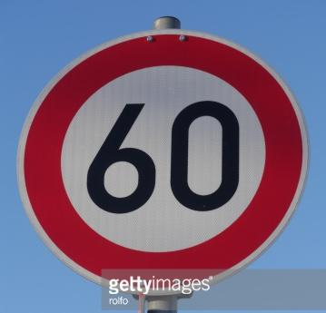

#**Traffic Sign Recognition** 

---

**Build a Traffic Sign Recognition Project**

### Writeup / README

This is my writeup for the Traffic Sign Classifier project.  You can find my code here [here](https://github.com/mmccuiston/CarND-Traffic-Sign-Classifier-Project/blob/master/Traffic_Sign_Classifier.ipynb) and the output from said notebook [here](https://github.com/mmccuiston/CarND-Traffic-Sign-Classifier-Project/blob/master/Traffic_Sign_Classifier.html)

### Data Set Summary & Exploration

#### 1. Dataset Summary

I used the numpy library to calculate summary statistics of the traffic
signs data set:

* The size of training set is 34799
* The size of the validation set is 4410
* The size of test set is 12630
* The shape of a traffic sign image is 32 x 32 x 3
* The number of unique classes/labels in the data set is 43

#### 2. Dataset Exploration

Here is an exploratory visualization of the data set. 

First a plot of a random image within the training set.

Second is a histogram of frequency of classes within the training, validation, and test sets.

### Design and Test a Model Architecture

#### 1. Image preprocessing

First I preprocessed the images by normalizing them between the values of -1 and 1.  I also converted the color images to grayscale.   Normalization should help the optimizer converge over fewer epochs.

The final model I used was a modified LeNet architecture described below.

#### 2. Final model architecture

| Layer         		|     Description	        					| 
|:---------------------:|:---------------------------------------------:| 
| Input         		| 32x32x1 Grayscale image   							| 
| Convolution 3x3     	| 1x1 stride, valid padding, outputs 28x28x6 	|
| RELU					|												|
| Max pooling	      	| 2x2 stride,  outputs 14x14x6 				|
| Drop-out| 50% drop-out rate |
| Convolution 3x3	    | 1x1 stride, valid padding, outputs 10x10x16 	|
| RELU					|												|
| Max pooling	      	| 2x2 stride,  outputs 5x5x16 				|
| Fully connected		| 400 to 120        									|
| RELU					|												|
| Drop-out| 50% drop-out keep rate |
| Fully connected		| 120 to 84        									|
| RELU					|												|
| Drop-out| 50% drop-out keep rate |
| Fully connected		| 84 to 43        									|
| RELU					|												|
| Softmax				|        									|

#### 3. Training

I trained my model using a batch size of 256 over 50 epochs.  I used the ADAM optimization algorithm with a learning rate of 0.001.

#### 4. 

My final model results were:
* training set accuracy of 99.8%
* validation set accuracy of 93.1% 
* test set accuracy of 91.1%

I decided to start with the Lenet architecture described below.

| Layer         		|     Description	        					| 
|:---------------------:|:---------------------------------------------:| 
| Input         		| 32x32x1 Grayscale image   							| 
| Convolution 3x3     	| 1x1 stride, valid padding, outputs 28x28x6 	|
| RELU					|												|
| Max pooling	      	| 2x2 stride,  outputs 14x14x6 				|
| Convolution 3x3	    | 1x1 stride, valid padding, outputs 10x10x16 	|
| RELU					|												|
| Max pooling	      	| 2x2 stride,  outputs 5x5x16 				|
| Fully connected		| 400 to 120        									|
| RELU					|												|
| Fully connected		| 120 to 84        									|
| RELU					|												|
| Fully connected		| 84 to 43        									|
| RELU					|												|
| Softmax				|        									|

With this architecture I was able to achieve validation accuracy I was finding the validation accuracy to be well above the training accuracy, suggesting overfitting.  To lessen overfitting I decided to add a drop-out layer after two of the fully connected layers giving the final model described in the previous section.

After adding drop-out the validation accuracy and the test set accuracy were within ~1% and around 93.1%.

The reason I chose to start with the Lenet architecture is because of it's success with similar problems such as detecting handwritten digits in the MNIST data set.  The eventual accuracy of 94% shows that the modified LeNet architecture is capable of being adapted to traffic sign detection as well.  I believe that with some additional augmentation of the dataset that the model is probably capable of higher scores.

### Test a Model on New Images

#### 1. Traffic signs from the web

Here are five German traffic signs that I found on the web:

The third image might be difficult to classify because the sign is off center and doesn't occupy the whole image.

#### 2. Model Predictions

Here are the results of the prediction:

| Image			        |     Prediction	        					| 
|:---------------------:|:---------------------------------------------:| 
| Stop			| General Caution      							|
| No  Entry      		| No Entry   									| 
| Speed Limit 30km/h					| Road work												|
| Priority Road     			| Priority Road 										|
| Speed Limit 60km/h		      		| Speed Limit 60km/h					 				|

The model guessed 3/5 signs correct which is significantly less than the test set accuracy.  As expected, the model had trouble with the image that was off-center and occupied the image partially.

#### 3. Model Certainty On Images From Web

The code for making predictions on my final model is located in the 12th cell of the Ipython notebook.

For all of the images the model shows very high probabilities.  Unfortunately, even when it is wrong.  The first image (stop sign) occupies more of the image than most other signs, so it may be due to scale that causes the innacurate prediction.  The third sign (30 km/h speed limit) is non-centered and smaller scale which may cause the innacurate prediction.  Either way, it is a bit concerning about the high probabilities being shown.

| Probability         	|     Prediction	        					| 
|:---------------------:|:---------------------------------------------:| 
| 0.989         			| General Caution   									| 
| 1.0     				| No Entry 										|
| 1.0					| Speed Limit 30km/h											|
| 1.0	      			| Priority Road					 				|
| 1.0				    | Speed Limit 60km/h      							|

